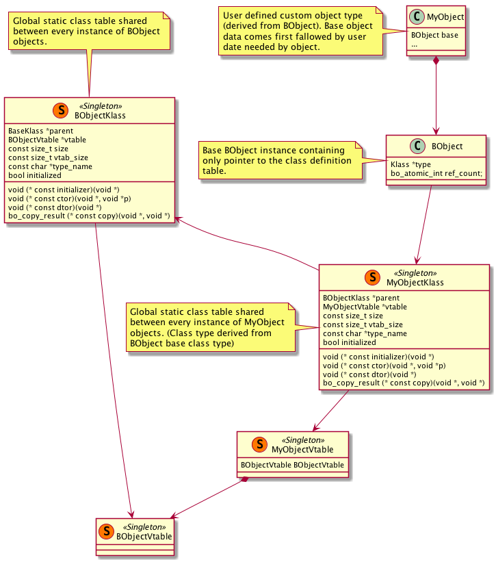

## About

The Biscuit Object is small library in C providing object oriented features for plane C projects.
Source code can be found [here](https://github.com/travisdoor/biscuit_object). BObject is inspired
by [ooc](http://ooc-coding.sourceforge.net/) project created by Tibor Miseta. The original ooc
includes not only OOP tools but also exception handling system, multiple interface inheritance
and other features which I don't want to use so I decided to create my own object system library.

## Motivation
- Brings object class structure to plane C.

- BObject is primary designed for Biscuit Engine where I want to use C# for game-play implementation
and scripting, in this case it is much easier and faster to use C where no wrappers are needed for 
calling "member" functions of the objects living in unmanaged scope.

## Features
- Class definition
- Single parent inheritance 
- Automatic construction and destruction of an object 
- Virtual table and method overriding 
- Runtime virtual method linking 
- New and delete 
- Automatic parent destructor call 

## Structure

## Other
The Biscuit Object use check unit testing framework and it is fully tested in real solutions and
projects.
